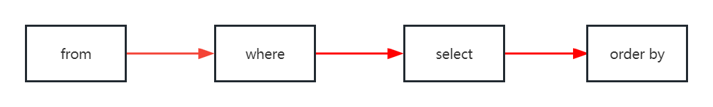
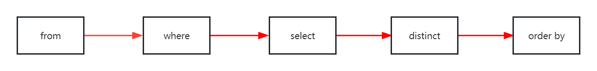

# Filtering data

## WHERE

The `WHERE` clause allows you to specify a *search condition* for the  rows returned by a query. The `SELECT` statement will include any row that satisfies the `search_condition`



## LIKE

The `LIKE` operator, basically is a match pattern. `%` wildcard matches any string of zero or more characters, `_` wildcard matches any single character

```mysql
SELECT 
	firstName, lastName
FROM
	employees
WHERE
	lastName LIKE '%son'
ORDER BY firstName;
```

Finds the employees whose last names end with the string 'son'

## IN

The `IN` operator returns `TRUE` if a value matches any value in a list

`value IN (value1, value2,...)`

```mysql
SELECT 
	firstName, lastName, officeCode
FROM
	employees
WHERE
	officeCode IN (1, 2, 3)
ORDER BY officeCode;
```

Finds employees who locate in the office with officeCode 1

## DISTINCT

Querying data always get duplicate rows. To get rid of excessive rows, using the `DISTINCT`



## LIMIT

The `LIMIT` clause is used in the `SELECT` statement to **constrain** the number of rows to return. The `LIMIT` clause accepts one or two arguments, both arguments must be zero or positive integers

```mysql
SELECT 
    column_name
FROM
    table_name
LIMIT [offset, ] row_count;
```

* The `offset` of the first row is 0, not 1
* The `row_count` specifies the maximum number of rows to return


When you use the `LIMIT` clause with one argument, MySQL will use this argument to determine the maximum number of rows to return from the first row of the result set

`LIMIT row_count` is equal to `LIMIT 0, row_count`

By default, the `SELECT` statement returns rows in an unspecified order. So if you add the `LIMIT` clause to the `SELECT` statement, the returned rows are **unpredictable**. To ensure the `LIMIT` clause returns an **expected** output, you should always use it with `order by` clause

```mysql
SELECT
    column_name
FROM
    table_name
ORDER BY 
    sort_expression
LIMIT offset, row_count;
```

For instance, if we want to get records from certain range, like  11-20, 1-20, the `LIMIT` is very useful

`LIMIT 10, 10;`

`LIMIT 0, 20;`

To get the $n^{th}$ highest or lowest value, we use the following `LIMIT` clause

```mysql
SELECT 
    column_name
FROM
    table_name
ORDER BY 
    sort_expression
LIMIT n - 1, 1;
```

Finds the customer who has the **second-highest** credit

```mysql
SELECT 
    customerName, 
    creditLimit
FROM
    customers
ORDER BY 
    creditLimit DESC  
LIMIT 1,1;
```
