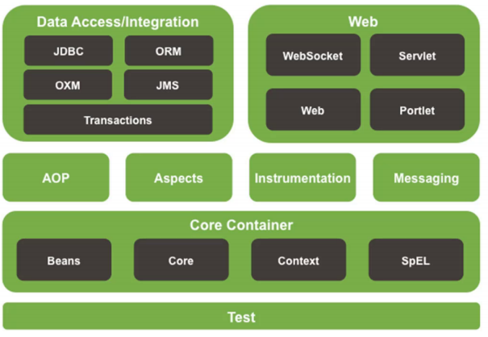

# Concepts



This is the system structure of `Spring`.

* Core Container: another version of `OOP`, store object
* Data Access/Integration: Deal with database
* Web: Spring MVC

## IoC

To understand what is IoC, we need to know what kind of situation we will deal with

For instance, we have two layers, business and data layers, and we wanna implement something

```java
// business layer
public class BookServiceImpl implements BookService{
    private BookDao bookDao = new BookServiceImpl1();
    public void save(){
        bookDao.save();
    }
}

// data layer
public class BookDaoImpl1 implements BookDao{
    public void save(){
        System.out.println("book dao save ...");
    }
}
```

We can see that, in business layer, we create an object and call its method. However, sometimes we have the requirement of modifying data layer

```java
// business layer
public class BookServiceImpl implements BookService{
    private BookDao bookDao = new BookServiceImpl2();
    public void save(){
        bookDao.save();
    }
}

// data layer
public class BookDaoImpl2 implements BookDao{
    public void save(){
        System.out.println("book dao save ...2");
    }
}
```

Not only we have to modify data layer, we also need to modify business layer, which means re-compiler, re-test, re-deploy, etc. - High Coupling

So how about erase the object, instead when we wanna use objects, don't create, we use objects which are provided externally, this is the idea of *IoC, inversion of control*

In Spring, core container is the *external*, in this case, also called **IoC container**

IoC container is responsible for initialize, create the object, this object in IoC container is called **Bean**

Sometimes, objects may have some relations, dependencies, IoC will build dependencies for these Beans, so called, DI, Dependency injection

This is the main purpose of Spring idea, de-coupling

* Use IoC to manage bean
* Build dependencies among beans, DI
* Therefore, we can just grab objects we wanna use, these beans are already binded all dependencies
